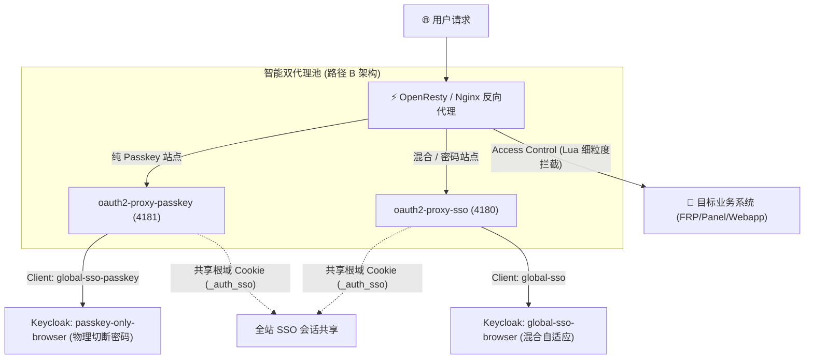

# 🔐 Keycloak Auth Manager

<p align="center">
  <strong>现代化 Web 访问控制与全站单点登录 (SSO) 管理控制台</strong>
</p>

<p align="center">
  
  
  
  
  
</p>

---

**Keycloak Auth Manager** 是一款专为开发者、站长与运维人员打造的现代化 **统一身份接入与单点登录 (SSO) 管理控制系统**。

通过轻量优雅的 Web 控制台，可在数秒内为服务器上的任意现有网站（无论是静态站、反代服务还是容器化应用）一键接入 **Keycloak 统一认证拦截、细粒度站点访问控制、全站 SSO 漫游以及苹果级 Passkey (WebAuthn) 免密直通体验**。

---

## 🌟 核心特性概览



### 1. 🔑 真·纯 Passkey 物理隔离架构（行业领先）
* **协议级物理切断密码**：非前端简单隐藏，而是通过 Keycloak 专属认证流在服务端彻底移除密码校验器，从协议层彻底阻断暴力破解与凭据撞库攻击。
* **双代理池轻量聚合**：采用常驻双 OAuth2-Proxy 容器架构（4180 混合池 + 4181 纯免密池），常驻内存增量仅约 15MB，同时完美保持全站根域 Cookie（`_auth_sso`）互通共享。

### 2. ⚡ 全站单点登录 (SSO) 无缝漫游
* 登录旗下任意一个子域名（如 `app1.example.com`），访问同一根域下的其他所有受保护站点（如 `app2.example.com`、`ops.example.com`）自动实现免密直通，无需反复登录。

### 3. 🛡️ 细粒度站点访问权限控制 (Access Control)
* 控制台内可按用户设定 **可访问站点白名单 (`allowed_sites`)**。
* 基于 OpenResty Lua 引擎在反代层实现**毫秒级高性能访问鉴权拦截**，未授权用户访问将呈现友好的 403 卡片并提供一键注销/切换账号入口。

### 4. 🎨 苹果级（Apple Design）极简美学主题
* 内置专为 Keycloak 26 深度定制的现代化登录主题，支持指纹/面容/安全密钥一键拉起、密码双向显隐切换、响应式暗色/亮色自适应以及无跳动平滑过渡。

### 5. ☁️ Cloudflare 域名与 DNS 自动化联动
* 自动拉取 Cloudflare 托管的主域名列表，新建站点时全自动配置 DNS A 记录，并支持一键开启或关闭 CDN 代理加速。

### 6. 🔒 企业级安全加固规范
* **凭据强加密**：系统敏感配置（管理员密码、Client Secret 等）均经 AES-GCM / Fernet 加密落地，强制限制 `0600` 文件权限。
* **XFF 防伪造**：引入标准 `ipaddress` 校验机制，仅信任来自 RFC 1918 私有地址与本地回环的可信反代，彻底杜绝 IP 伪造。
* **全流程脱敏**：日志与调试输出全面内置敏感信息脱敏过滤器，杜绝 Token/密钥泄露。

---

## 🛠️ 三种站点认证策略对比

在控制台内，您可以按站点粒度随时切换认证策略：

| 认证模式 | 适用场景 | 交互体验 | 安全级别 |
| :--- | :--- | :--- | :--- |
| **纯 Passkey 认证** | 极客站点、核心内部系统 | 直接拉起 Touch ID / Face ID / 安全密钥，协议层无密码入口 | ⭐️⭐️⭐️⭐️⭐️ (防钓鱼/防撞库) |
| **混合自适应认证** | 通用业务站点、多设备场景 | 同时支持账号密码与「一键直通 Passkey 免密登录」 | ⭐️⭐️⭐️⭐️ (兼顾便利与兼容) |
| **纯密码认证** | 传统设备、无生物识别终端 | 仅保留账号密码输入框，隐藏免密选项 | ⭐️⭐️⭐️ (基础口令保护) |

---

## 📦 系统依赖与环境要求

| 依赖程序 | 建议版本 | 作用说明 |
| :--- | :--- | :--- |
| **Docker** | 20.0+ | 用于运行 SSO 代理容器与 Keycloak 身份中心 |
| **Python 3 / pip3** | 3.8+ | 控制面板后台（Flask）运行环境 |
| **Keycloak** | 26.x | 核心身份认证服务，提供 OIDC/OAuth2 与 WebAuthn 支持 |
| **1Panel 面板** | 最新版 | 网站建站与证书管理面板（自动同步反代配置） |
| **OpenResty** | 最新版 | 高性能 Web 反向代理，通过 `auth_request` 与 Lua 实现流量拦截 |
| **Cloudflare** *(可选)* | API Token | 用于实现域名 DNS 解析自动绑定与 CDN 代理联动 |

---

## 🚀 快速开始与部署

### 方式一：远程一键全自动部署（推荐）

在服务器终端执行以下命令，脚本将自动检查依赖并引导完成初次初始化：

```bash
curl -sSL https://raw.githubusercontent.com/Level6me/keycloak-auth-manager/main/install.sh | bash
```

### 方式二：克隆源码本地部署

```bash
git clone https://github.com/Level6me/keycloak-auth-manager.git
cd keycloak-auth-manager
bash install.sh
```

### 访问控制台

部署完成后，使用浏览器访问：
* **控制台入口**：`http://<服务器IP>:8088`
* **默认凭据**：安装向导中设置的管理员账号与密码

---

## 🔄 一键平滑热更新

更新脚本会自动保留您的所有站点数据（`data.json`）、系统配置（`config.json`）与主加密密钥（`encryption.key`），实现无损平滑热升级：

```bash
curl -sSL https://raw.githubusercontent.com/Level6me/keycloak-auth-manager/main/update.sh | bash
```

---

## 🧭 运维与服务管理命令

```bash
systemctl status keycloak-auth-manager    # 查看管理服务运行状态
systemctl restart keycloak-auth-manager   # 重启管理服务
systemctl stop keycloak-auth-manager      # 停止管理服务
journalctl -u keycloak-auth-manager -f    # 实时查看运行日志
```

---

## 🧪 自动化测试

项目内置了完整的安全基线与回归测试套件（覆盖 XFF 防伪造、域名正则注入防护、IPv6 兼容性、密码兼容加载与路径 B 端口分流）：

```bash
python3 -m unittest discover -s tests -p "test_*.py" -v
```

---

## 📄 开源许可证

本项目采用 [MIT License](LICENSE) 协议开源。欢迎提交 Issue 与 Pull Request 共同完善！

