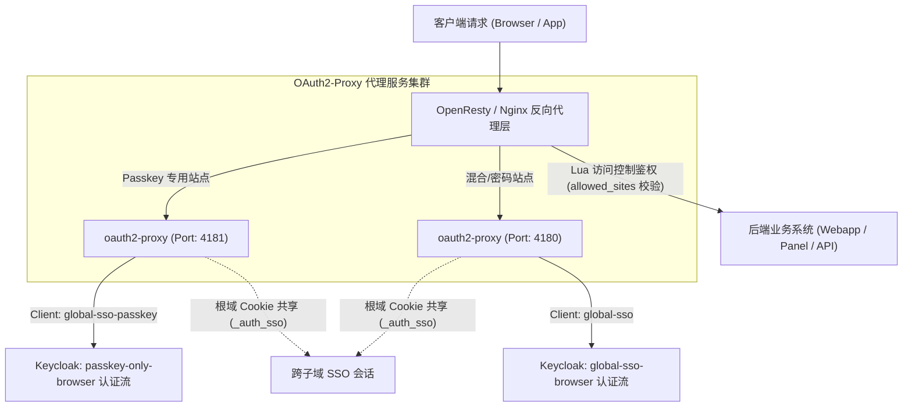

# Keycloak Auth Manager

<p align="center">
  <strong>基于 OpenResty、OAuth2-Proxy 与 Keycloak 的 Web 访问控制与单点登录 (SSO) 管理系统</strong>
</p>

<p align="center">
  
  
  
  
  
</p>

---

## 📖 项目简介

**Keycloak Auth Manager** 是一款面向现代化 Web 架构的 **统一身份认证与访问控制管理平台**。

系统通过集成 OpenResty 反向代理、OAuth2-Proxy 鉴权网关与 Keycloak 身份服务中心，支持在不修改后端业务代码的前提下，快速为目标服务接入统一身份认证、细粒度站点访问控制、跨子域单点登录（SSO）以及 FIDO2 / WebAuthn (Passkey) 凭据验证。

---

## 🏛️ 系统架构



---

## ⚡ 核心功能特性

### 1. 独立认证流隔离与 Passkey 模式
* **服务端禁用口令流**：针对高安全性要求的系统，在 Keycloak 服务端认证流中直接配置独立的 Browser Flow，禁用密码校验器，仅允许 WebAuthn 凭据认证。
* **双代理实例分流**：根据站点设定的认证模式，自动分流至对应的 OAuth2-Proxy 代理实例（4180 混合模式 / 4181 Passkey 模式），同时保持根域 Cookie（`_auth_sso`）会话互通。

### 2. 跨子域单点登录 (SSO)
* 用户在任一受保护的子域名（如 `app1.example.com`）完成认证后，访问同一主域名下的其他受保护站点（如 `app2.example.com`）无需重复鉴权，自动共享登录状态。

### 3. 细粒度站点访问权限控制 (Access Control)
* 支持按用户维度配置 **允许访问站点白名单 (`allowed_sites`)**。
* 基于 OpenResty Lua 引擎在反向代理层进行访问权限鉴权拦截，未授权用户访问将直接呈现标准 403 页面并支持切换账号。

### 4. OIDC 客户端管理
* 提供标准化 OIDC 客户端应用配置与管理接口，支持对接 WordPress、GitLab、Gitea 等支持 OpenID Connect 协议的第三方系统。
* 支持快捷配置重定向 URI 白名单与注销重定向地址。

### 5. 定制化登录主题
* 内置适配 Keycloak 26 的现代化响应式主题，支持 WebAuthn 硬件凭据唤起、密码显隐切换及深浅色模式自适应。

### 6. 数据安全与配置加固
* **凭据加密存储**：敏感配置（数据库密码、Client Secret 等）均采用 AES-GCM / Fernet 加密落地，配置文件权限严格限制为 `0600`。
* **XFF 来源可信校验**：基于标准 `ipaddress` 校验机制，仅信任来自私有网络与本地回环的可信反向代理。
* **日志脱敏过滤**：内置日志过滤器，自动脱敏 Token、密钥等敏感信息。

---

## 📊 认证模式技术对比

| 认证模式 | 认证流配置说明 | 适用场景 | 安全机制 |
| :--- | :--- | :--- | :--- |
| **仅 Passkey 模式** | 服务端仅启用 WebAuthn 校验器，不提供密码输入入口 | 高安全内部管理系统、运维控制台 | 基于 FIDO2/WebAuthn 公私钥签名验证，杜绝弱口令与钓鱼风险 |
| **混合认证模式** | 认证流同时支持账号密码与 WebAuthn 凭据 | 通用业务站点、多终端混合办公场景 | 支持用户自主选择 Passkey 快捷验证或账号密码登录 |
| **仅密码模式** | 仅保留标准用户名与密码校验器 | 无生物识别硬件的设备与通用系统 | 基于标准密码哈希凭据验证 |

---

## 📦 系统依赖与环境要求

| 依赖组件 | 建议版本 | 作用说明 |
| :--- | :--- | :--- |
| **Docker** | 20.0+ | 用于运行 OAuth2-Proxy 代理容器与 Keycloak 服务 |
| **Python 3 / pip3** | 3.8+ | 管理控制台后台服务运行环境 |
| **Keycloak** | 26.x | 核心身份认证服务，提供 OIDC/OAuth2 与 WebAuthn 支持 |
| **1Panel 面板** | 最新版 | 站点与 SSL 证书管理面板（自动同步反向代理配置） |
| **OpenResty** | 最新版 | 高性能 Web 反向代理，通过 `auth_request` 与 Lua 实现流量鉴权 |
| **Cloudflare** *(可选)* | API Token | 用于域名 DNS 解析自动同步与 CDN 状态联动 |

---

## 🚀 部署指引

### 方式一：远程脚本部署

```bash
curl -sSL https://raw.githubusercontent.com/Level6me/keycloak-auth-manager/main/install.sh | bash
```

### 方式二：克隆源码本地部署

```bash
git clone https://github.com/Level6me/keycloak-auth-manager.git
cd keycloak-auth-manager
bash install.sh
```

### 控制台访问

部署完成后，在浏览器中访问：
* **控制台地址**：`http://<服务器IP>:8088`
* **初始凭据**：安装向导中配置的管理员账号与密码

---

## 🔄 系统更新

运行更新脚本将自动备份数据文件（`data.json`）、配置文件（`config.json`）与加密密钥（`encryption.key`），并拉取最新代码平滑重启服务：

```bash
curl -sSL https://raw.githubusercontent.com/Level6me/keycloak-auth-manager/main/update.sh | bash
```

---

## 🧭 服务管理命令

```bash
systemctl status keycloak-auth-manager    # 查看管理服务运行状态
systemctl restart keycloak-auth-manager   # 重启管理服务
systemctl stop keycloak-auth-manager      # 停止管理服务
journalctl -u keycloak-auth-manager -f    # 查看运行日志
```

---

## 🧪 自动化测试

项目内置完整的单元测试与安全基线验证套件：

```bash
python3 -m unittest discover -s tests -p "test_*.py" -v
```

---

## 📄 开源许可证

本项目采用 [MIT License](LICENSE) 协议开源。

